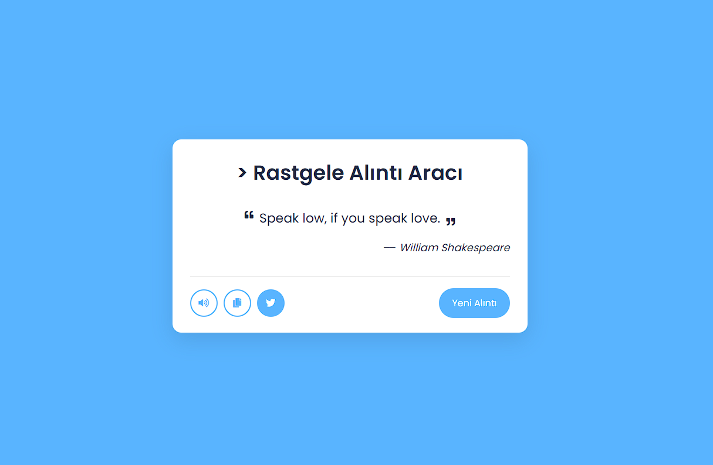

# 📚 İngilizce Alıntı Üretme Aracı

Bu proje, kullanıcıların rastgele İngilizce alıntıları görebileceği, okuyabileceği, kopyalayabileceği ve hatta sosyal medya üzerinde paylaşabileceği bir web uygulamasını içerir.

## 🌟 Özellikler

- **Rastgele Alıntılar**: Her tıklamada yeni ve ilham verici bir alıntı alın.
- **Sesli Okuma**: Alıntıları sesli olarak okuyun ve duyduğunuzda ilham alın. (Ses Hala Geliştirme aşamasında)
- **Alıntıları Kopyalama**: Alıntıları kolayca panoya kopyalayın ve kullanın.
- **Twitter'da Paylaşma**: Beğendiğiniz alıntıları doğrudan Twitter'da paylaşın.

## 🚀 Kullanım

1. Projeyi klonlayın veya indirin.
2. `index.html` dosyasını bir web tarayıcısında açın.
3. Rastgele alıntıları gözlemleyin ve kullanın.

## 🖥️ Ekran Görüntüsü

## 📦 Kullanılan Diller  

- HTML
- CSS
- JavaScript 

## 📌 Kaynaklar

- Alıntılar: [Quotable API](http://api.quotable.io/)
- Font: [Google Fonts - Poppins](https://fonts.google.com/specimen/Poppins)

## 🤝 Katkıda Bulunma

Katkılarınız benim için önemli. Herhangi bir hata bulursanız veya önerileriniz varsa, lütfen bir [pull request](link) gönderin.

## 📞 İletişim

Herhangi bir sorunuz veya geri bildiriminiz varsa, lütfen bana [mail](mailto:contact@azadcoder.com) veya [Instagram](https://instagram.com/kodlama.dili) hesabı üzerinden ulaşın.
